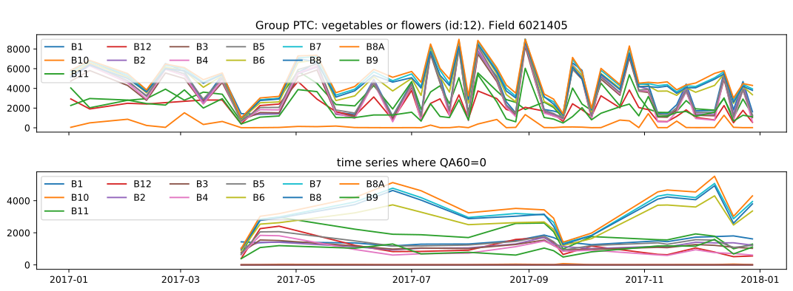
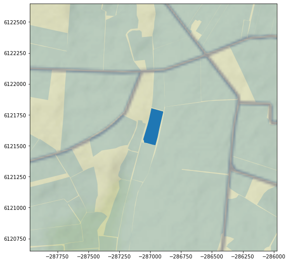
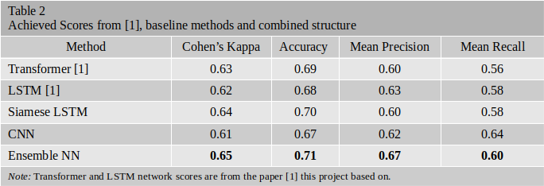

# Multi Temporal and Multispectral Remotely Sensed Crop Classification

### Description
Today, satellites observe the earth surface at weekly intervals and measure the reflectance values of the surfaces at various spectral wavelengths. There are different tasks that can be solved using data produced by these satellites such as detecting changes over a region, calculating expected amount of crops or classifying the crop types.

In this project, it is aimed to classify 13 different agricultural products using multi temporal and multispectral information. The project is based on a paper, Rußwurm et. al. "**BreizhCrops: A Satellite Time Series Dataset for Crop Type Identification**", Arxiv, 2019, Available: https://arxiv.org/abs/1905.11893, in which they also published the dataset for the benchmarking purpose. They applied recurrent and auto-encoder structures to classify agricultural products. Yet, in the classification task, there is a known problem named inter-class similarities and intra-class differences. A metric learning approach is proposed in this project in order to solve this problem and classify better. In addition, convolutional approaches are designed and combined with metric learning approaches into an ensemble structure for more accuracte clasification.

### Dataset Review

The dataset was created and published by the paper, Rußwurm et. al, this project is based on , using the data collected by the Sentinel 2 satellite over the 580.000 parcels in the Brittany region of France. The data has been collected at L1C processing level and all D = 13 spectral bands located in one field parcel were mean aggregated to a feature vector. The vector contains multi temporal data each of which consists of the 13 spectral wavelengths.

  

Example values of a vegetables crop type collected from april to december in 2017 is given above. The satellite has observed the same field parcel, shown below, at weekly intervals, so that the data contains approximately 45 time samples while each of them consists of the spectral wavelengths of reflectance of the surfaces.

  

### Design
As explained above, there are three neural network architectures designed, implemented, trained and tested for this task:

1. Siamese LSTM : A metric learning approach is designed with a Siamese Network structure where the learned feature vectors are projected into another space in which the Euclidean distances of the elements from the same classes are forced to be small, close to each other. In order to process the multi temporal information while learning a discriminative metric, a recurrent architecture, LSTM, is employed with the Siamese structure.

2. CNN : A CNN architecture is designed to process the multi temporal and multispectral information, 45 x 13 (45 time samples each having 13 spectral band info), as the width and height of an image. Also, the dataset suffers from the class imbalance problem. In order to reduce the effect of this problem, a CNN architecture is designed with a Weighted Cross Entropy Loss function where the weights are set by the inverse proportion of corresponding samples.

3. Ensemble NN: This architecture is designed with the purpose of combining both of the networks' concerns for more accurate results. It is aimed to learn a discriminative metric with Siamese LSTM structure to solve inter-class similarity and intra-class difference problem. In addition, CNN architecture is designed to reduce the effect of class imbalance problem. Finally, by combining these networks, it is aimed to learn a discriminative metric while carefully considering the less sampled products.

### Experiments & Results
There are many methods and techniques applied throughout the development of the project. Yet, below only the successful experiments are given.

**All of the models are trained, validated and tested on the corresponding sets.** Confusion matrices of the models are acquired by validating on the validation set, and the other scores are retrieved by applying to test set.

*  Siamese LSTM : The network was trained 30 epochs, took nearly one day, where the last training loss was 0.3175. Training was stopped after 5 epoch’s training loss was not decreased by 0.01 with respect to the previous one. This architecture achieved 0.64 as a Kappa score, 0.70 as an overall accuracy, 0.60 as a Mean Precision and 0.58 as a Mean Recall. Below the confusion matrix of the model retrieved on the validation set is shown.

  

* CNN: The network was trained 45 epochs, took approximately 1 day, with Adam optimizer where initial learning rate was 0.001. Training was stopped after 10 epoch’s training loss was not decreased by 0.01 with respect to the previous one. This architecture achieved 0.61 as a Kappa score, 0.67 as an overall accuracy, 0.62 as a Mean Precision and 0.64 as a Mean Recall. 

  

As seen on the confusion matrix, calculated on the validation set, this structure attached more importance to 4th and 6th classes.

* The network was trained 25 epochs, took nearly 5 days, where the last training loss was 0.64. Training was stopped after 5 epoch’s training loss was not decreased by 0.01 with respect to the previous one. This architecture achieved 0.65 as a Kappa score, 0.71 as an overall accuracy, 0.67 as a Mean Precision and 0.60 as a Mean Recall. 

  

As seen on the confusion matrix, calculated on the validation set, this structure learned a better metric for classification while considering the less sampled products.

### Results

As seen on the table 1, the Ensemble Neural Network architecture outperforms both the models proposed by the paper this project based on and the models this network built upon. Although the Ensemble NN contains nearly 2 million parameters, its computational cost is nearly the same as others.

  

